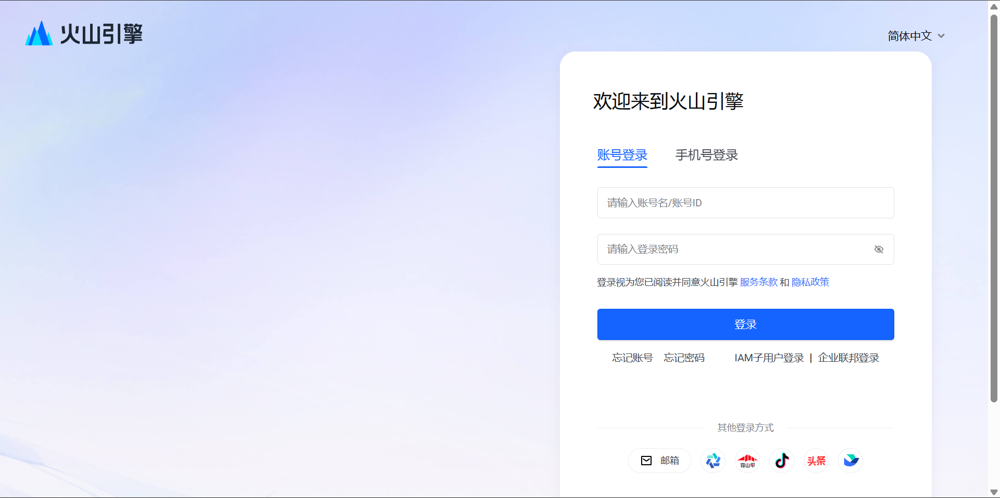
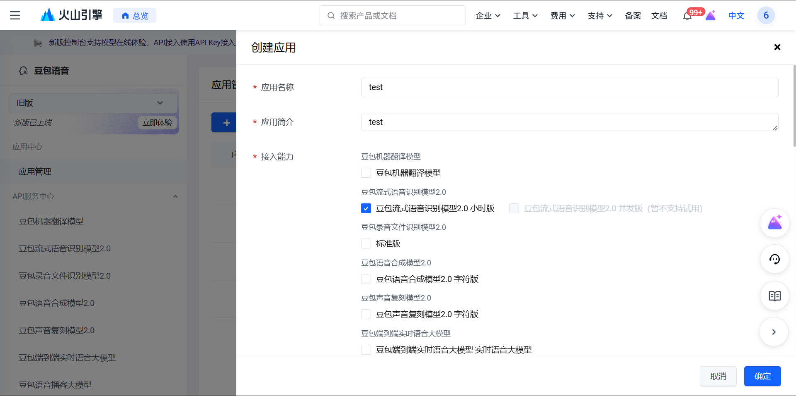
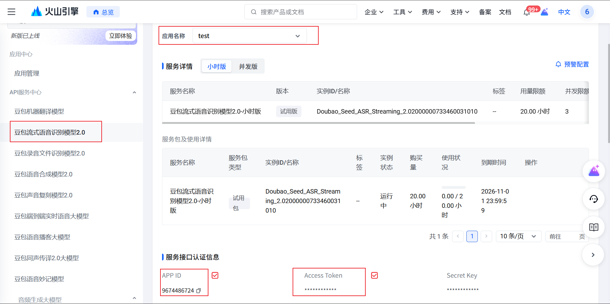
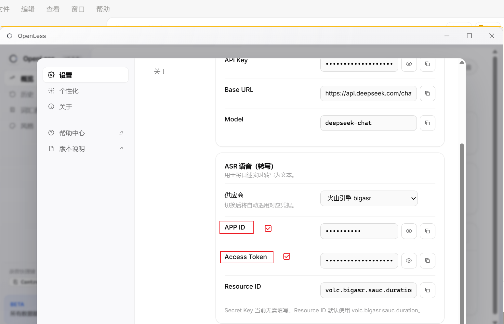

# OpenLess 火山 ASR 配置

1. 登录火山引擎  
   <https://console.volcengine.com/auth/login/>

   

2. 创建旧版应用  
   创建时勾选 `豆包流式语音识别模型2.0 小时版`  
   <https://console.volcengine.com/speech/app?opt=create>

   

3. 打开豆包流式语音识别模型 2.0 管理页  
   `APP ID` 和 `Access Token` 在页面最下方  
   <https://console.volcengine.com/speech/service/10038?AppID=&opt=create>

   

4. 复制到 OpenLess 的 `Settings` 页面

   打开：

   `Settings -> Providers -> ASR`

   

   填这两个：

   - `APP ID`
   - `Access Token`

   不用填：

   - `Secret Key`
